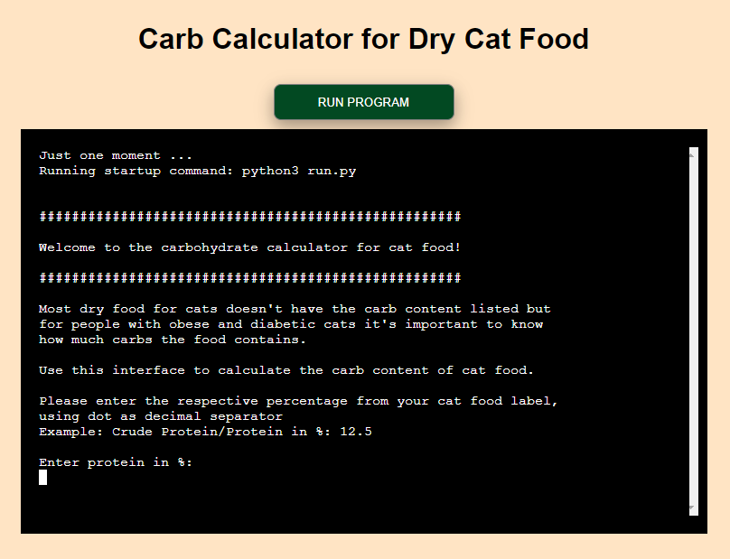
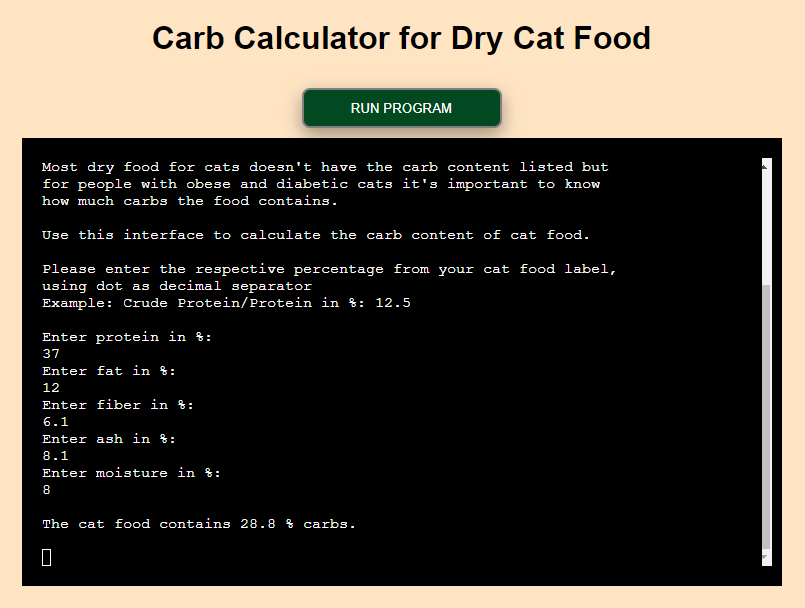
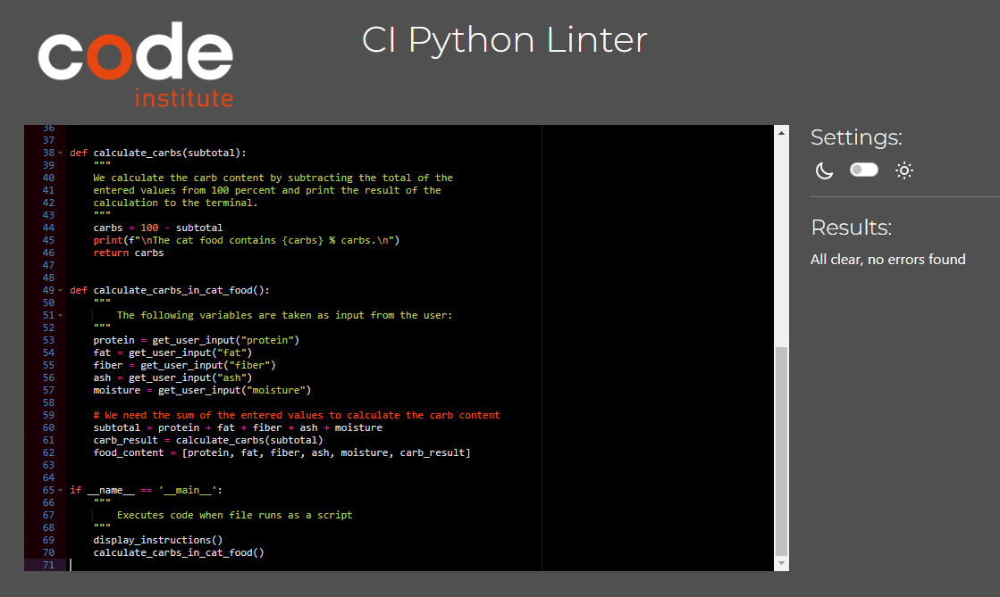
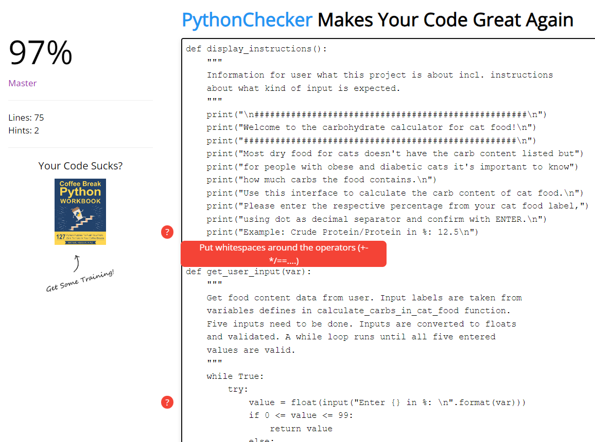
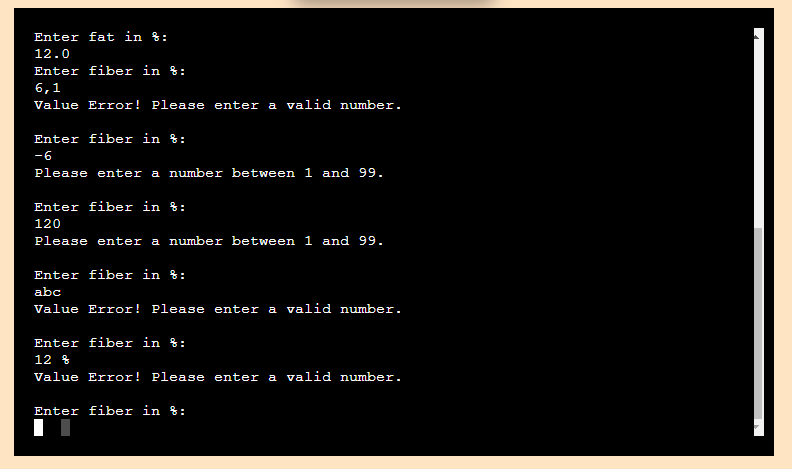

# Carb Calculator for Dry Cat Food

## Introduction

### Project Description

The [Carb Calculator for Dry Cat Food](https://cat-food-carb-calculator-6b47be69c58d.herokuapp.com/) is a tool for cat owners that enables the user to calculate the percentage of carbohydrates in dry cat food. 

### Project Purpose

Cats are obligate carnivores, meaning they require meat in their diet and need little carbohydrates. Dry food diets can present many health challenges because they are typically high in fat, carbohydrates, and calories. In fact, a high-carb diet can lead to obesity and diabetes. 

Thus, it's quite important for cat owners, especially if they already have an obese and/or diabetic cat, to know how many carbs their beloved pet consumes. Unfortunately it's not mandatory for cat food manufacturers to label the carb content on their products. 

The [Carb Calculator for Dry Cat Food](https://cat-food-carb-calculator-6b47be69c58d.herokuapp.com/) supports the pet owners by calculating the carb content of dry cat food. 

## User stories

User story: As a user I want to know the carb content of cat food so that I can adjust the diet of my cat to avoid health issues.

End user goal: The user calculates the carb content of dry cat food.

End business goal: The users' cat lives a long and healthy life.

## Features

### Start

When starting the Heroku app the user finds information about what the tool is about. 

### Input

The user is required to enter percentages of protein, fat, fiber, ash and moisture which can be found on the cat food packages.   

### Calculation

When the above mentioned values are entered correctly, the tool calculates the carb content which is displayed to the user.

### Run Program

When the user clicks on the Run Program-button the entries will be reset and the user is prompted to enter the data from the cat food label.

## Future Features

While the current version is fully functional, there are some ideas for future development:

- Enable the user to enter product name
- Enable user to save the result
- Enable user to save multiple results for comparison
- Add calculation for wet cat food 
- Add calculation for dog food

## Technology

- IDE: GitPod
- Repository: GitHub
- Deployment: Heroku

## Testing

### Validator Testing

- No errors were returned when passing through the [CI Python Linter](https://pep8ci.herokuapp.com/).

- Two hints were returned when passing through the [Python Checker](https://www.pythonchecker.com/) but these are irrelevant as they concern text that is displayed to the user.

### Manual Testing

#### Features Testing

| Feature  | Action |Result|
| ------------- | ------------- |-------------|
|Start|
| Interface	  | Loading  | The interface shows two rows on top saying "Just one moment ...Running startup command: python3 run.py"|
| Interface  | Display  | Shows title of the app and introduction text to the user |
|Input area  |   |  |
| Input  | The user enters a positive integer  | The number is displayed below the enter command |
| Input  | The user enters a decimal number, with dot as separator  | The number is displayed below the enter command |
| Input  | The user enters a decimal number, with comma as separator  | An error is displayed: "Value Error! Please enter a valid number." |
| Input  | The user enters a negative number  | An error is displayed: "Please enter a number between 1 and 99." |
| Input  | The user enters a number, larger than 99  | An error is displayed: "Please enter a number between 1 and 99." |
| Input  | The user enters letters  | An error is displayed: "Value Error! Please enter a valid number." |
| Input  | The user enters a number and a character | An error is displayed: "Value Error! Please enter a valid number." |
| Calculation  | When all five values are entered correct the carb content is calculated | The result is shown below the input: "The cat food contains xx % carbs." |
| Run Program  | Click | The input and result are deleted and the user can start to enter new data |

### Browser Testing

Functionality was tested with the following browsers without any issues:

- Microsoft Edge Version 118.0.2088.76
- Firefox Version 118.0.1
- Brave Version 1.58.135
- Google Chrome Version 116.0.5845.188
  
### Findings under testing

- Even though inputs were entered with only one decimal, the calculation showed a result with 8 decimals so the round-method was used to limit the number of decimals to 1 in the calculation result.

## Deployment

- The repository was created on GitHub using the template provided by Code Institute. 
- New workspace was created on GitPod using the repository link from GitHub.
- Code was written using GitPod. No additional libraries needed to be imported.
- Deployment followed the instructions from Code Institute:
    - Add new line character and the end of the text inside the input method
    - Create list of requirements
    - Create new app on Heroku platform
    - Add Config Var in Heroku's settings
    - Add buildpacks Python and Node.js
    - Choose deployment method
    - Connect to GitHub
    - Deploy

 
The live link to the app can be found here: 
[Carb Calculator for Dry Cat Food](https://cat-food-carb-calculator-6b47be69c58d.herokuapp.com/)

## Credits

### Content

Inspiration and calculation formula from the following websites that contain carb calculators:
- [NfE-Rechner für Diabetes-Katzen](https://nfe-rechner.de/)
- [petMD](https://www.petmd.com/blogs/nutritionnuggets/cat/jcoates/2013/sept/calculating-carbohydrates-in-your-cats-food-30887)

Information about cat diets in chapter "Project purpose":
- [VetMed Texas A&M University](https://vetmed.tamu.edu/news/pet-talk/cats-are-carnivores-so-they-should-eat-like-one/)

 
### Inspiration, support and tutorials from

- Code Institute Tutor Assistance
- Code Institute Instruction video for deployment to Heroku
- [American Pizza Order System](https://american-pizza-order-system.herokuapp.com/) for changing html background
- [Stack overflow](https://stackoverflow.com/)
- Special thanks to my fellow student Elina, and my mentor Rohit Sharma

